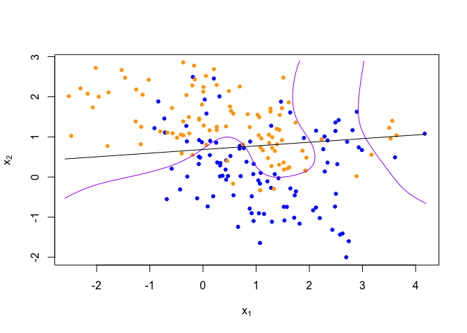
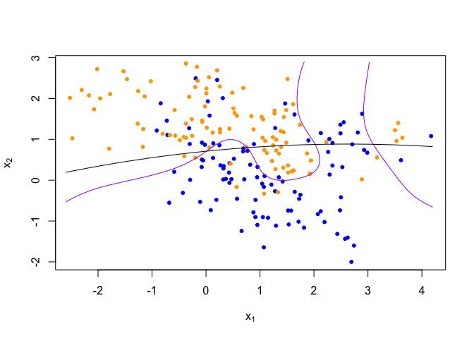
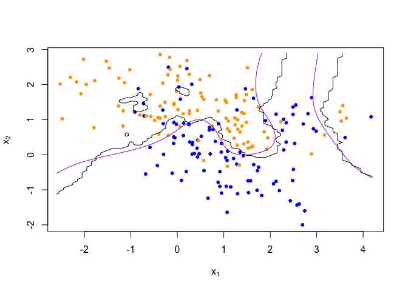
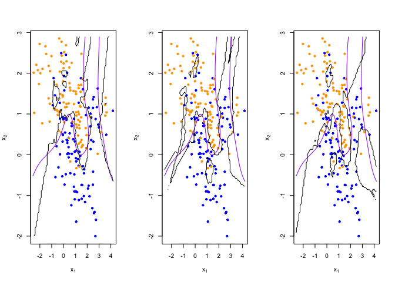

Zhengqi_Tian_Homework1
================
Zhengqi Tian
January 15, 2020

``` r
library('class')
library('dplyr')
```

    ## 
    ## Attaching package: 'dplyr'

    ## The following objects are masked from 'package:stats':
    ## 
    ##     filter, lag

    ## The following objects are masked from 'package:base':
    ## 
    ##     intersect, setdiff, setequal, union

## load binary classification example data from author website

## ‘ElemStatLearn’ package no longer available

``` r
load(url('https://web.stanford.edu/~hastie/ElemStatLearn/datasets/ESL.mixture.rda'))
dat <- ESL.mixture

plot_mix_data <- expression({
  plot(dat$x[,1], dat$x[,2],
       col=ifelse(dat$y==0, 'blue', 'orange'),
       pch=20,
       xlab=expression(x[1]),
       ylab=expression(x[2]))
  ## draw Bayes (True) classification boundary
  prob <- matrix(dat$prob, length(dat$px1), length(dat$px2))
  cont <- contourLines(dat$px1, dat$px2, prob, levels=0.5)
  rslt <- sapply(cont, lines, col='purple')
})

eval(plot_mix_data)
```

<!-- -->

## fit linear classifier

``` r
fit_lc <- function(y, x) {
  x <- cbind(1, x)
  beta <- drop(solve(t(x)%*%x)%*%t(x)%*%y)
}
```

## make predictions from linear classifier

``` r
predict_lc <- function(x, beta) {
  cbind(1, x) %*% beta
}
```

## fit model to mixture data and make predictions

``` r
lc_beta <- fit_lc(dat$y, dat$x)
lc_pred <- predict_lc(dat$xnew, lc_beta)
```

## reshape predictions as a matrix

``` r
lc_pred <- matrix(lc_pred, length(dat$px1), length(dat$px2))
contour(lc_pred,
      xlab=expression(x[1]),
      ylab=expression(x[2]))
```

<!-- -->

## find the contours in 2D space such that lc_pred == 0.5

``` r
lc_cont <- contourLines(dat$px1, dat$px2, lc_pred, levels=0.5)
```

## plot data and decision surface

``` r
eval(plot_mix_data)
sapply(lc_cont, lines)
```

<!-- -->

    ## [[1]]
    ## NULL

## Rewrite predictions from linear classifier for Question3

``` r
predict_lc_Q3 <- function(x) {
  traindata<-data.frame(x,dat$y)
  traindata<-data.frame(cbind(traindata,y=dat$y))
  colnames(traindata)<-c('x1','x2','y')
  predict(lm(y~x1+x2,data=traindata),data.frame(dat$xnew))
}
```

## Rewrite fit model to mixture data and make predictions for Question3

``` r
lc_pred_Q3 <- predict_lc_Q3(dat$x)
```

## reshape predictions as a matrix for Question3

``` r
lc_pred_Q3 <- matrix(lc_pred_Q3, length(dat$px1), length(dat$px2))
contour(lc_pred_Q3,
      xlab=expression(x[1]),
      ylab=expression(x[2]))
```

<!-- -->
## find the contours in 2D space such that lc_pred == 0.5 for Question 3

``` r
lc_cont_Q3 <- contourLines(dat$px1, dat$px2, lc_pred_Q3, levels=0.5)
```

## plot data and decision surface for Question 3

``` r
eval(plot_mix_data)
sapply(lc_cont_Q3, lines)
```

<!-- -->

    ## [[1]]
    ## NULL

## Rewrite predictions from linear classifier for question 4

``` r
predict_lc_Q4 <- function(x) {
  traindata<-data.frame(x,dat$y)
  traindata<-data.frame(cbind(traindata,y=dat$y))
  colnames(traindata)<-c('x1','x2','y')
  predict(lm(y~x1+x2+I(x1^2)+I(x1^2),data=traindata),data.frame(dat$xnew))
}
```

## Rewrite fit model to mixture data and make predictions for Question 4

``` r
lc_pred_Q4 <- predict_lc_Q4(dat$x)
```

## reshape predictions as a matrix for question 4

``` r
lc_pred_Q4 <- matrix(lc_pred_Q4, length(dat$px1), length(dat$px2))
contour(lc_pred_Q4,
      xlab=expression(x[1]),
      ylab=expression(x[2]))
```

<!-- -->
## find the contours in 2D space such that lc_pred == 0.5 for question 4

``` r
lc_cont_Q4 <- contourLines(dat$px1, dat$px2, lc_pred_Q4, levels=0.5)
```

## plot data and decision surfacefor question 4

``` r
eval(plot_mix_data)
sapply(lc_cont_Q4, lines)
```

<!-- -->

    ## [[1]]
    ## NULL

#Describe how this more flexible model affects the bias-variance
tradeoff

``` r
eval(plot_mix_data)
sapply(lc_cont, lines)
```

    ## [[1]]
    ## NULL

``` r
sapply(lc_cont_Q4, lines)
```

<!-- -->

    ## [[1]]
    ## NULL

#Variance Comparsion

``` r
traindata<-data.frame(dat$x,dat$y)
traindata<-data.frame(cbind(traindata,y=dat$y))
colnames(traindata)<-c('x1','x2','y')
summary(lm(y~x1+x2,data=traindata))$sigma^2
```

    ## [1] 0.1804128

``` r
summary(lm(y~x1+x2+I(x1^2)+I(x1^2),data=traindata))$sigma^2
```

    ## [1] 0.1811255

# As we adding adding squared terms for x1 and x2 to the linear model, the regression is going more complicate. Thus, the straight line becomes a curve. Thus, we can find that the variance incrase and the bias decrease. Thus, we should make a trade-off between variance and bias.

## plot data and decision surface

``` r
eval(plot_mix_data)
```

<!-- -->

``` r
line(lc_pred)
```

    ## 
    ## Call:
    ## line(lc_pred)
    ## 
    ## Coefficients:
    ## [1]  0.01248  1.00000

## fit knn classifier

## use 5-NN to estimate probability of class assignment

``` r
knn_fit <- knn(train=dat$x, test=dat$xnew, cl=dat$y, k=5, prob=TRUE)
knn_pred <- attr(knn_fit, 'prob')
knn_pred <- ifelse(knn_fit == 1, knn_pred, 1-knn_pred)
```

## reshape predictions as a matrix

``` r
knn_pred <- matrix(knn_pred, length(dat$px1), length(dat$px2))
contour(knn_pred,
        xlab=expression(x[1]),
        ylab=expression(x[2]),
        levels=c(0.2, 0.5, 0.8))
```

<!-- -->

## find the contours in 2D space such that knn_pred == 0.5

``` r
knn_cont <- contourLines(dat$px1, dat$px2, knn_pred, levels=0.5)
```

## plot data and decision surface

``` r
eval(plot_mix_data)
sapply(knn_cont, lines)
```

<!-- -->

    ## [[1]]
    ## NULL
    ## 
    ## [[2]]
    ## NULL
    ## 
    ## [[3]]
    ## NULL
    ## 
    ## [[4]]
    ## NULL
    ## 
    ## [[5]]
    ## NULL

## do bootstrap to get a sense of variance in decision surface

``` r
resample <- function(dat) {
  idx <- sample(1:length(dat$y), replace = T)
  dat$y <- dat$y[idx]
  dat$x <- dat$x[idx,]
  return(dat)
}
```

## plot linear classifier for three bootstraps

``` r
par(mfrow=c(1,3))
for(b in 1:3) {
  datb <- resample(dat)
  ## fit model to mixture data and make predictions
  lc_beta <- fit_lc(datb$y, datb$x)
  lc_pred <- predict_lc(datb$xnew, lc_beta)
  lc_pred_Q3 <- predict_lc_Q3(dat$x)
  lc_pred_Q4 <- predict_lc_Q4(dat$x)
  
  ## reshape predictions as a matrix
  lc_pred <- matrix(lc_pred, length(datb$px1), length(datb$px2))
  lc_pred_Q3 <- matrix(lc_pred_Q3, length(datb$px1), length(datb$px2))
  lc_pred_Q4 <- matrix(lc_pred_Q4, length(datb$px1), length(datb$px2))

  ## find the contours in 2D space such that lc_pred == 0.5
  lc_cont <- contourLines(datb$px1, datb$px2, lc_pred, levels=0.5)
  lc_cont_Q3 <- contourLines(datb$px1, datb$px2, lc_pred_Q3, levels=0.5)
  lc_cont_Q4 <- contourLines(datb$px1, datb$px2, lc_pred_Q4, levels=0.5)
  
  ## plot data and decision surface
  eval(plot_mix_data)
  sapply(lc_cont, lines,col="Blue")
  sapply(lc_cont_Q3, lines,col="Red")
  sapply(lc_cont_Q4, lines,col="Green")

}
```

<!-- -->
## plot 5-NN classifier for three bootstraps

``` r
par(mfrow=c(1,3))
for(b in 1:3) {
  datb <- resample(dat)
  
  knn_fit <- knn(train=datb$x, test=datb$xnew, cl=datb$y, k=5, prob=TRUE)
  knn_pred <- attr(knn_fit, 'prob')
  knn_pred <- ifelse(knn_fit == 1, knn_pred, 1-knn_pred)
  
  ## reshape predictions as a matrix
  knn_pred <- matrix(knn_pred, length(datb$px1), length(datb$px2))

  ## find the contours in 2D space such that knn_pred == 0.5
  knn_cont <- contourLines(datb$px1, datb$px2, knn_pred, levels=0.5)
  
  ## plot data and decision surface
  eval(plot_mix_data)
  sapply(knn_cont, lines)
}
```

<!-- -->

## plot 20-NN classifier for three bootstraps

``` r
par(mfrow=c(1,3))
for(b in 1:3) {
  datb <- resample(dat)
  
  knn_fit <- knn(train=datb$x, test=datb$xnew, cl=datb$y, k=20, prob=TRUE)
  knn_pred <- attr(knn_fit, 'prob')
  knn_pred <- ifelse(knn_fit == 1, knn_pred, 1-knn_pred)
  
  ## reshape predictions as a matrix
  knn_pred <- matrix(knn_pred, length(datb$px1), length(datb$px2))
  
  ## find the contours in 2D space such that knn_pred == 0.5
  knn_cont <- contourLines(datb$px1, datb$px2, knn_pred, levels=0.5)
  
  ## plot data and decision surface
  eval(plot_mix_data)
  sapply(knn_cont, lines)
}
```

<!-- -->
