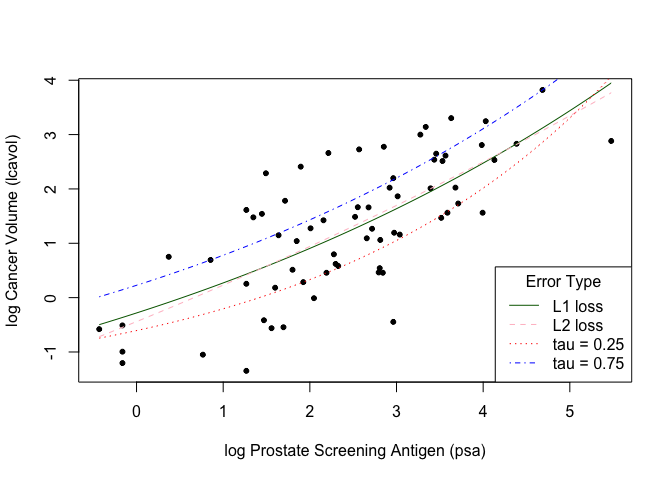

Homework2
================
Zhengqi Tian
1/30/2022

## load prostate data

``` r
prostate <- 
  read.table(url(
    'https://web.stanford.edu/~hastie/ElemStatLearn/datasets/prostate.data'))
```

## subset to training examples

``` r
prostate_train <- subset(prostate, train==TRUE)
```

## plot lcavol vs lpsa

``` r
plot_psa_data <- function(dat=prostate_train) {
  plot(dat$lpsa, dat$lcavol,
       xlab="log Prostate Screening Antigen (psa)",
       ylab="log Cancer Volume (lcavol)",
       pch = 20)
}
plot_psa_data()
```

<!-- -->

############################ 

## regular linear regression

############################ 

## L2 loss function

``` r
L2_loss <- function(y, yhat)
  (y-yhat)^2
```

## fit simple linear model using numerical optimization

``` r
fit_lin <- function(y, x, loss=L2_loss, beta_init = c(-0.51, 0.75)) {
  err <- function(beta)
    mean(loss(y,  beta[1] + beta[2]*x))
  beta <- optim(par = beta_init, fn = err)
  return(beta)
}
```

## make predictions from linear model

``` r
predict_lin <- function(x, beta)
  beta[1] + beta[2]*x
```

## fit linear model

``` r
lin_beta <- fit_lin(y=prostate_train$lcavol,
                    x=prostate_train$lpsa,
                    loss=L2_loss)
```

## compute predictions for a grid of inputs

``` r
x_grid <- seq(min(prostate_train$lpsa),
              max(prostate_train$lpsa),
              length.out=100)
lin_pred <- predict_lin(x=x_grid, beta=lin_beta$par)
```

## plot data

``` r
plot_psa_data()
## plot predictions
lines(x=x_grid, y=lin_pred, col='darkgreen', lwd=2)

## do the same thing with 'lm'
lin_fit_lm <- lm(lcavol ~ lpsa, data=prostate_train)
## make predictins using 'lm' object
lin_pred_lm <- predict(lin_fit_lm, data.frame(lpsa=x_grid))
## plot predictions from 'lm'
lines(x=x_grid, y=lin_pred_lm, col='pink', lty=2, lwd=2)
```

<!-- -->

################################## 

## try modifying the loss function

################################## 

## custom loss function

``` r
custom_loss <- function(y, yhat)
  (y-yhat)^2 + abs(y-yhat)
```

## plot custom loss function

``` r
err_grd <- seq(-1,1,length.out=200)
plot(err_grd, custom_loss(err_grd,0), type='l',
     xlab='y-yhat', ylab='custom loss')
```

<!-- --> \#\# fit
linear model with custom loss

``` r
lin_beta_custom <- fit_lin(y=prostate_train$lcavol,
                    x=prostate_train$lpsa,
                    loss=custom_loss)

lin_pred_custom <- predict_lin(x=x_grid, beta=lin_beta_custom$par)
```

## plot data

``` r
plot_psa_data()
## plot predictions from L2 loss
lines(x=x_grid, y=lin_pred, col='darkgreen', lwd=2)
## plot predictions from custom loss
lines(x=x_grid, y=lin_pred_custom, col='pink', lwd=2, lty=2)
```

<!-- -->

# Questions

# Question 1: Write functions that implement the L1 loss and tilted absolute loss functions.

``` r
## L1 loss function
L1_loss <- function(y, yhat) {
  abs(y-yhat)
}

## tilted absolute loss functions.
tilted.abs <-function(y, yhat,tau){
  x<-y-yhat  
  ifelse(x>0, x*tau, x*(tau-1))
}
```

# Question 2: Create a figure that shows lpsa (x-axis) versus lcavol (y-axis). Add and label (using the ‘legend’ function) the linear model predictors associated with L2 loss, L1 loss, and tilted absolute value loss for tau = 0.25 and 0.75.

``` r
## fit linear model with L1 loss
lin_beta_L1 <- fit_lin(y=prostate_train$lcavol,
                    x=prostate_train$lpsa,
                    loss=L1_loss)
## make predictions from linear model with L1 loss
lin_pred_L1 <- predict_lin(x=x_grid, beta=lin_beta_L1$par)

## fit linear model with L2 loss
lin_beta_L2 <- fit_lin(y=prostate_train$lcavol,
                    x=prostate_train$lpsa,
                    loss=L2_loss)
## make predictions from linear model with L2 loss
lin_pred_L2 <- predict_lin(x=x_grid, beta=lin_beta_L2$par)

## fit linear model with tau=0.25 loss
require(tidyverse)
lin_beta_tau25 <- fit_lin(y=prostate_train$lcavol,
                    x=prostate_train$lpsa,
                    loss=partial(tilted.abs,tau=0.25))
## make predictions from linear model with tau=0.25 loss
lin_pred_tau25 <- predict_lin(x=x_grid, beta=lin_beta_tau25$par)

## fit linear model with tau=0.75 loss
require(tidyverse)
lin_beta_tau75 <- fit_lin(y=prostate_train$lcavol,
                    x=prostate_train$lpsa,
                    loss=partial(tilted.abs,tau=0.75))
## make predictions from linear model with tau=0.75 loss
lin_pred_tau75 <- predict_lin(x=x_grid, beta=lin_beta_tau75$par)


## plot data
plot_psa_data()
## plot predictions from L1 loss
lines(x=x_grid, y=lin_pred_L1, col='darkgreen', lty=1)
## plot predictions from L2 loss
lines(x = x_grid, y = lin_pred_L2 , col = 'pink', lty=2)
## plot predictions from linear model with tau=0.25 loss
lines(x = x_grid, y = lin_pred_tau25, col = 'red', lty=3)
## plot predictions from linear model with tau=0.75 loss
lines(x = x_grid, y = lin_pred_tau75, col = 'blue',lty=4)
legend("bottomright", title="Error Type",c("L1 loss", "L2 loss","tau = 0.25", "tau = 0.75"), lty = c(1,2,3,4),col = c("darkgreen","pink", "red", "blue"))
```

<!-- -->

# Write functions to fit and predict from a simple nonlinear model with three parameters defined by ‘beta\[1\] + beta\[2\]*exp(-beta\[3\]*x)’. Hint: make copies of ‘fit\_lin’ and ‘predict\_lin’ and modify them to fit the nonlinear model. Use c(-1.0, 0.0, -0.3) as ‘beta\_init’.

``` r
## make predictions from nonlinear model
fit_nonlinear <- function(y, x, loss=L2_loss, beta_init = c(-1.0, 0.0, -0.3)) {
  err <- function(beta)
    mean(loss(y,  beta[1] + beta[2]*exp(-beta[3]*x)))
  beta <- optim(par = beta_init, fn = err)
  return(beta)
}

## make predictions from nonlinear model
predict_nonlinear <- function(x, beta)
  beta[1] + beta[2]*exp(-beta[3]*x)
```

# Create a figure that shows lpsa (x-axis) versus lcavol (y-axis). Add and label (using the ‘legend’ function) the nonlinear model predictors associated with L2 loss, L1 loss, and tilted absolute value loss for tau = 0.25 and 0.75.

``` r
## fit nonlinear model with L1 loss
nonlinear_beta_L1 <- fit_nonlinear(y=prostate_train$lcavol,
                    x=prostate_train$lpsa,
                    loss=L1_loss)
## make predictions from nonlinear model with L1 loss
nonlinear_pred_L1 <- predict_nonlinear(x=x_grid, beta=nonlinear_beta_L1$par)

## fit nonlinear model with L2 loss
nonlinear_beta_L2 <- fit_nonlinear(y=prostate_train$lcavol,
                    x=prostate_train$lpsa,
                    loss=L2_loss)
## make predictions from nonlinear model with L2 loss
nonlinear_pred_L2 <- predict_nonlinear(x=x_grid, beta=nonlinear_beta_L2$par)

## fit nonlinear model with tau=0.25 loss
require(tidyverse)
nonlinear_beta_tau25 <- fit_nonlinear(y=prostate_train$lcavol,
                    x=prostate_train$lpsa,
                    loss=partial(tilted.abs,tau=0.25))
## make predictions from nonlinear model with tau=0.25 loss
nonlinear_pred_tau25 <- predict_nonlinear(x=x_grid, beta=nonlinear_beta_tau25$par)

## fit nonlinear model with tau=0.75 loss
require(tidyverse)
nonlinear_beta_tau75 <- fit_nonlinear(y=prostate_train$lcavol,
                    x=prostate_train$lpsa,
                    loss=partial(tilted.abs,tau=0.75))
## make predictions from nonlinear model with tau=0.75 loss
nonlinear_pred_tau75 <- predict_nonlinear(x=x_grid, beta=nonlinear_beta_tau75$par)


## plot data
plot_psa_data()
## plot predictions from L1 loss
lines(x=x_grid, y=nonlinear_pred_L1, col='darkgreen', lty=1)
## plot predictions from L2 loss
lines(x = x_grid, y = nonlinear_pred_L2 , col = 'pink', lty=2)
## plot predictions from linear model with tau=0.25 loss
lines(x = x_grid, y = nonlinear_pred_tau25, col = 'red', lty=3)
## plot predictions from linear model with tau=0.75 loss
lines(x = x_grid, y = nonlinear_pred_tau75, col = 'blue',lty=4)
legend("bottomright", title="Error Type",c("L1 loss", "L2 loss","tau = 0.25", "tau = 0.75"), lty = c(1,2,3,4),col = c("darkgreen","pink", "red", "blue"))
```

<!-- -->
