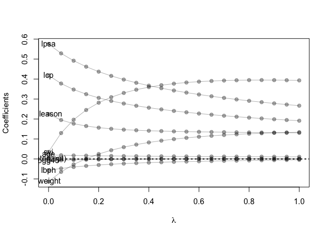

Homework3
================
Zhengqi Tian
2/8/2022

Homework 3

Using the RMarkdown/knitr/github mechanism, implement the following
tasks: Use the prostate cancer data. Use the cor function to reproduce
the correlations listed in HTF Table 3.1, page 50. Treat lcavol as the
outcome, and use all other variables in the data set as predictors. With
the training subset of the prostate data, train a least-squares
regression model with all predictors using the lm function. Use the
testing subset to compute the test error (average squared-error loss)
using the fitted least-squares regression model. Train a ridge
regression model using the glmnet function, and tune the value of lambda
(i.e., use guess and check to find the value of lambda that
approximately minimizes the test error). Create a figure that shows the
training and test error associated with ridge regression as a function
of lambda Create a path diagram of the ridge regression analysis,
similar to HTF Figure 3.8

``` r
library('splines')        
library('tidyverse')          
```

    ## ── Attaching packages ─────────────────────────────────────── tidyverse 1.3.1 ──

    ## ✓ ggplot2 3.3.5     ✓ purrr   0.3.4
    ## ✓ tibble  3.1.6     ✓ dplyr   1.0.7
    ## ✓ tidyr   1.1.4     ✓ stringr 1.4.0
    ## ✓ readr   2.0.2     ✓ forcats 0.5.1

    ## ── Conflicts ────────────────────────────────────────── tidyverse_conflicts() ──
    ## x dplyr::filter() masks stats::filter()
    ## x dplyr::lag()    masks stats::lag()

``` r
library('magrittr')       
```

    ## 
    ## Attaching package: 'magrittr'

    ## The following object is masked from 'package:purrr':
    ## 
    ##     set_names

    ## The following object is masked from 'package:tidyr':
    ## 
    ##     extract

``` r
library('glmnet')         
```

    ## Loading required package: Matrix

    ## 
    ## Attaching package: 'Matrix'

    ## The following objects are masked from 'package:tidyr':
    ## 
    ##     expand, pack, unpack

    ## Loaded glmnet 4.1-3

# Use the prostate cancer data.

``` r
# problem 1
prostate <- 
  read.table(url(
    'https://web.stanford.edu/~hastie/ElemStatLearn/datasets/prostate.data'))

#subset to training examples
prostate_train <- subset(prostate, train==TRUE)%>%
  select(-train)
summary(prostate_train)
```

    ##      lcavol           lweight           age             lbph         
    ##  Min.   :-1.3471   Min.   :2.375   Min.   :41.00   Min.   :-1.38629  
    ##  1st Qu.: 0.4883   1st Qu.:3.330   1st Qu.:61.00   1st Qu.:-1.38629  
    ##  Median : 1.4679   Median :3.599   Median :65.00   Median :-0.05129  
    ##  Mean   : 1.3135   Mean   :3.626   Mean   :64.75   Mean   : 0.07144  
    ##  3rd Qu.: 2.3491   3rd Qu.:3.884   3rd Qu.:69.00   3rd Qu.: 1.54751  
    ##  Max.   : 3.8210   Max.   :4.780   Max.   :79.00   Max.   : 2.32630  
    ##       svi              lcp             gleason          pgg45       
    ##  Min.   :0.0000   Min.   :-1.3863   Min.   :6.000   Min.   :  0.00  
    ##  1st Qu.:0.0000   1st Qu.:-1.3863   1st Qu.:6.000   1st Qu.:  0.00  
    ##  Median :0.0000   Median :-0.7985   Median :7.000   Median : 15.00  
    ##  Mean   :0.2239   Mean   :-0.2142   Mean   :6.731   Mean   : 26.27  
    ##  3rd Qu.:0.0000   3rd Qu.: 0.9948   3rd Qu.:7.000   3rd Qu.: 50.00  
    ##  Max.   :1.0000   Max.   : 2.6568   Max.   :9.000   Max.   :100.00  
    ##       lpsa        
    ##  Min.   :-0.4308  
    ##  1st Qu.: 1.6673  
    ##  Median : 2.5688  
    ##  Mean   : 2.4523  
    ##  3rd Qu.: 3.3652  
    ##  Max.   : 5.4775

``` r
#subset to test examples
prostate_test <- subset(prostate, train==F)%>%
  select(-train)
summary(prostate_test)
```

    ##      lcavol           lweight           age             lbph        
    ##  Min.   :-0.7765   Min.   :2.865   Min.   :43.00   Min.   :-1.3863  
    ##  1st Qu.: 0.7965   1st Qu.:3.480   1st Qu.:60.00   1st Qu.:-1.3863  
    ##  Median : 1.4446   Median :3.651   Median :64.00   Median : 0.4383  
    ##  Mean   : 1.4316   Mean   :3.635   Mean   :61.90   Mean   : 0.1649  
    ##  3rd Qu.: 2.0531   3rd Qu.:3.838   3rd Qu.:67.75   3rd Qu.: 1.5728  
    ##  Max.   : 3.4720   Max.   :4.121   Max.   :70.00   Max.   : 2.1713  
    ##       svi           lcp             gleason        pgg45            lpsa       
    ##  Min.   :0.0   Min.   :-1.3863   Min.   :6.0   Min.   : 0.00   Min.   :0.7655  
    ##  1st Qu.:0.0   1st Qu.:-1.3863   1st Qu.:6.0   1st Qu.: 0.00   1st Qu.:1.8644  
    ##  Median :0.0   Median :-0.4308   Median :7.0   Median : 8.00   Median :2.5915  
    ##  Mean   :0.2   Mean   :-0.1016   Mean   :6.8   Mean   :20.17   Mean   :2.5365  
    ##  3rd Qu.:0.0   3rd Qu.: 1.0867   3rd Qu.:7.0   3rd Qu.:35.00   3rd Qu.:2.8820  
    ##  Max.   :1.0   Max.   : 2.9042   Max.   :9.0   Max.   :90.00   Max.   :5.5829

# Use the cor function to reproduce the correlations listed in HTF Table 3.1, page 50.

``` r
#Corrleations for train data set
cor(prostate_train)
```

    ##             lcavol    lweight       age        lbph        svi         lcp
    ## lcavol  1.00000000 0.30023199 0.2863243  0.06316772  0.5929491  0.69204308
    ## lweight 0.30023199 1.00000000 0.3167235  0.43704154  0.1810545  0.15682859
    ## age     0.28632427 0.31672347 1.0000000  0.28734645  0.1289023  0.17295140
    ## lbph    0.06316772 0.43704154 0.2873464  1.00000000 -0.1391468 -0.08853456
    ## svi     0.59294913 0.18105448 0.1289023 -0.13914680  1.0000000  0.67124021
    ## lcp     0.69204308 0.15682859 0.1729514 -0.08853456  0.6712402  1.00000000
    ## gleason 0.42641407 0.02355821 0.3659151  0.03299215  0.3068754  0.47643684
    ## pgg45   0.48316136 0.07416632 0.2758057 -0.03040382  0.4813577  0.66253335
    ## lpsa    0.73315515 0.48521519 0.2276424  0.26293763  0.5568864  0.48920320
    ##            gleason       pgg45      lpsa
    ## lcavol  0.42641407  0.48316136 0.7331551
    ## lweight 0.02355821  0.07416632 0.4852152
    ## age     0.36591512  0.27580573 0.2276424
    ## lbph    0.03299215 -0.03040382 0.2629376
    ## svi     0.30687537  0.48135774 0.5568864
    ## lcp     0.47643684  0.66253335 0.4892032
    ## gleason 1.00000000  0.75705650 0.3424278
    ## pgg45   0.75705650  1.00000000 0.4480480
    ## lpsa    0.34242781  0.44804795 1.0000000

# Treat lcavol as the outcome, and use all other variables in the data set as predictors.

#With the training subset of the prostate data, train a least-squares
regression model with all predictors using the lm function.

``` r
# least-squares regression
fit <- lm(lcavol ~ ., data=prostate_train)
summary(fit)
```

    ## 
    ## Call:
    ## lm(formula = lcavol ~ ., data = prostate_train)
    ## 
    ## Residuals:
    ##      Min       1Q   Median       3Q      Max 
    ## -1.71027 -0.50138  0.03103  0.51352  1.35376 
    ## 
    ## Coefficients:
    ##              Estimate Std. Error t value Pr(>|t|)    
    ## (Intercept) -2.173357   1.526699  -1.424    0.160    
    ## lweight     -0.113370   0.236639  -0.479    0.634    
    ## age          0.020102   0.013571   1.481    0.144    
    ## lbph        -0.056981   0.072525  -0.786    0.435    
    ## svi          0.035116   0.313526   0.112    0.911    
    ## lcp          0.418455   0.099521   4.205 9.16e-05 ***
    ## gleason      0.224387   0.198812   1.129    0.264    
    ## pgg45       -0.009113   0.005451  -1.672    0.100 .  
    ## lpsa         0.575455   0.107235   5.366 1.47e-06 ***
    ## ---
    ## Signif. codes:  0 '***' 0.001 '**' 0.01 '*' 0.05 '.' 0.1 ' ' 1
    ## 
    ## Residual standard error: 0.7116 on 58 degrees of freedom
    ## Multiple R-squared:  0.7118, Adjusted R-squared:  0.672 
    ## F-statistic:  17.9 on 8 and 58 DF,  p-value: 3.999e-13

# Use the testing subset to compute the test error (average squared-error loss) using the fitted least-squares regression model.

``` r
## functions to compute testing/training error w/lm
L2_loss <- function(y, yhat)
  (y-yhat)^2
error <- function(dat, fit, loss=L2_loss)
  mean(loss(dat$lcavol, predict(fit, newdata=dat)))

## train_error 
error(prostate_train, fit)
```

    ## [1] 0.4383709

``` r
## testing error
error(prostate_test, fit)
```

    ## [1] 0.5084068

# Use the testing subset to compute the test error (average squared-error loss) using the fitted least-squares regression model.

``` r
## use glmnet to fit lasso
## glmnet fits using penalized L2 loss
## first create an input matrix and output vector
form  <- lcavol ~  lweight + age + lbph + lcp + pgg45 + lpsa + svi + gleason
x_inp <- model.matrix(form, data=prostate_train)
y_out <- prostate_train$lcavol
fit <- glmnet(x=x_inp, y=y_out, lambda=seq(0.5, 0, -0.05),alpha=0)
print(fit$beta)
```

    ## 9 x 11 sparse Matrix of class "dgCMatrix"

    ##    [[ suppressing 11 column names 's0', 's1', 's2' ... ]]

    ##                                                                    
    ## (Intercept)  .             .             .             .           
    ## lweight      0.0993164708  9.167566e-02  0.0826683948  0.0719539791
    ## age          0.0129153943  1.324527e-02  0.0136179441  0.0140406458
    ## lbph        -0.0145798645 -1.634009e-02 -0.0183250211 -0.0206075810
    ## lcp          0.2406189663  2.481045e-01  0.2566365965  0.2662889674
    ## pgg45        0.0002559092 -6.282802e-05 -0.0004352183 -0.0008738898
    ## lpsa         0.3427088262  3.542773e-01  0.3670625828  0.3813402190
    ## svi          0.3767521726  3.693591e-01  0.3595330020  0.3468674180
    ## gleason      0.1379543516  1.394770e-01  0.1413173561  0.1436779615
    ##                                                                             
    ## (Intercept)  .            .            .            .            .          
    ## lweight      0.059127616  0.043652593  0.024777969  0.001504802 -0.027603986
    ## age          0.014526957  0.015088490  0.015748487  0.016532948  0.017480107
    ## lbph        -0.023258103 -0.026377963 -0.030098852 -0.034621150 -0.040241264
    ## lcp          0.277447149  0.290342311  0.305728439  0.324372008  0.347616547
    ## pgg45       -0.001398912 -0.002031353 -0.002810371 -0.003788173 -0.005050263
    ## lpsa         0.397429712  0.415786556  0.437009864  0.461951799  0.491849702
    ## svi          0.330415198  0.309283880  0.281608260  0.245177911  0.196427346
    ## gleason      0.146778188  0.150949425  0.156678907  0.164800413  0.176722769
    ##                                      
    ## (Intercept)  .            .          
    ## lweight     -0.064680201 -0.113137304
    ## age          0.018643148  0.020098181
    ## lbph        -0.047425776 -0.056962692
    ## lcp          0.377657417  0.418431830
    ## pgg45       -0.006739814 -0.009116838
    ## lpsa         0.528596455  0.575318051
    ## svi          0.129711598  0.035342349
    ## gleason      0.194999807  0.224585243

``` r
## functions to compute testing/training error with glmnet
error <- function(dat, fit, lam, form, loss=L2_loss) {
  x_inp <- model.matrix(form, data=dat)
  y_out <- dat$lcavol
  y_hat <- predict(fit, newx=x_inp, s=lam)  ## see predict.elnet
  mean(loss(y_out, y_hat))
}

## train_error at lambda=0
error(prostate_train, fit, lam=0, form=form)
```

    ## [1] 0.4383709

``` r
## testing error at lambda=0
error(prostate_test, fit, lam=0, form=form)
```

    ## [1] 0.5083923

``` r
## train_error at lambda=0.01
error(prostate_train, fit, lam=0.01, form=form)
```

    ## [1] 0.4385064

``` r
## testing error at lambda=0.01
error(prostate_test, fit, lam=0.01, form=form)
```

    ## [1] 0.5047688

``` r
## train_error at lambda=0.02
error(prostate_train, fit, lam=0.02, form=form)
```

    ## [1] 0.4389101

``` r
## testing error at lambda=0.02
error(prostate_test, fit, lam=0.02, form=form)
```

    ## [1] 0.5016231

``` r
## train_error at lambda=0.03
error(prostate_train, fit, lam=0.03, form=form)
```

    ## [1] 0.4395821

``` r
## testing error at lambda=0.03
error(prostate_test, fit, lam=0.03, form=form)
```

    ## [1] 0.498955

``` r
## train_error at lambda=0.04
error(prostate_train, fit, lam=0.04, form=form)
```

    ## [1] 0.4405224

``` r
## testing error at lambda=0.04
error(prostate_test, fit, lam=0.04, form=form)
```

    ## [1] 0.4967647

``` r
## train_error at lambda=0.05
error(prostate_train, fit, lam=0.05, form=form)
```

    ## [1] 0.4417309

``` r
## testing error at lambda=0.05
error(prostate_test, fit, lam=0.05, form=form)
```

    ## [1] 0.4950521

``` r
## train_error at lambda=0.06
error(prostate_train, fit, lam=0.06, form=form)
```

    ## [1] 0.4428172

``` r
## testing error at lambda=0.06
error(prostate_test, fit, lam=0.06, form=form)
```

    ## [1] 0.4937929

# Train a ridge regression model using the glmnet function, and tune the value of lambda (i.e., use guess and check to find the value of lambda that approximately minimizes the test error).

# Create a figure that shows the training and test error associated with ridge regression as a function of lambda

``` r
# compute training and testing errors as function of lambda
err_train_1 <- sapply(fit$lambda, function(lam) 
  error(prostate_train, fit, lam, form))
err_test_1 <- sapply(fit$lambda, function(lam) 
  error(prostate_test, fit, lam, form))

## plot test/train error
plot(x=range(fit$lambda),
     y=range(c(err_train_1, err_test_1)),
     xlim=rev(range(fit$lambda)),
     type='n',
     xlab=expression(lambda),
     ylab='train/test error')
points(fit$lambda, err_train_1, pch=19, type='b', col='darkblue')
points(fit$lambda, err_test_1, pch=19, type='b', col='darkred')
legend('topright', c('train','test'), lty=1, pch=19,
       col=c('darkblue','darkred'), bty='n')
```

<!-- -->

``` r
colnames(fit$beta) <- paste('lam =', fit$lambda)
#print(fit$beta %>% as.matrix)
```

\`

# Create a path diagram of the ridge regression analysis, similar to HTF Figure 3.8

``` r
plot(x=range(fit$lambda),
     y=range(as.matrix(fit$beta)),
     type='n',
     xlab=expression(lambda),
     ylab='Coefficients')
for(i in 1:nrow(fit$beta)) {
  points(x=fit$lambda, y=fit$beta[i,], pch=19, col='#00000055')
  lines(x=fit$lambda, y=fit$beta[i,], col='#00000055')
}
abline(h=0, lty=3, lwd=2)
#Label the lines
text(x=0, y=fit$beta[,ncol(fit$beta)], 
     labels=rownames(fit$beta))
```

<!-- -->
