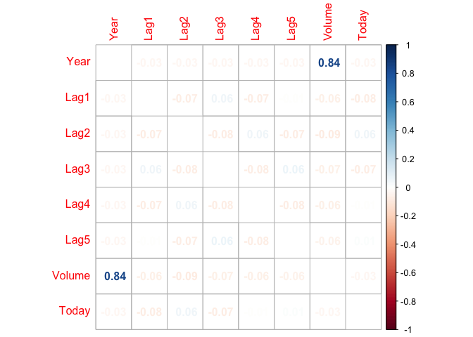

homework4
================

Question 4

When the number of features p is large, there tends to be a deteri-
oration in the performance of KNN and other local approaches that
perform prediction using only observations that are near the test
observation for which a prediction must be made. This phenomenon is
known as the curse of dimensionality, and it ties into the fact that
curse of di- non-parametric approaches often perform poorly when p is
large. We will now investigate this curse.

1.  Suppose that we have a set of observations, each with measure- ments
    on p = 1 feature, X. We assume that X is uniformly (evenly)
    distributed on \[0, 1\]. Associated with each observation is a
    response value. Suppose that we wish to predict a test obser-
    vation’s response using only observations that are within 10 % of
    the range of X closest to that test observation. For instance, in
    order to predict the response for a test observation with X = 0.6,
    we will use observations in the range \[0.55,0.65\]. On average,
    what fraction of the available observations will we use to make the
    prediction?

∫<sub>0.05</sub><sup>0.95</sup>10*d**x* + ∫<sub>0.05</sub><sup>0</sup>(100*x*+5)*d**x* + ∫<sub>0.95</sub><sup>1</sup>(105−100*x*)*d**x* = 9 + 0.375 + 0.375 = 9.75

2.  Now suppose that we have a set of observations, each with
    measurements on p = 2 features, X1 and X2. We assume that (X1, X2)
    are uniformly distributed on \[0, 1\] × \[0, 1\]. We wish to predict
    a test observation’s response using only observations that are
    within 10 % of the range of X1 and within 10 % of the range of X2
    closest to that test observation. For instance, in order to predict
    the response for a test observation with X1 = 0.6 and X2 = 0.35, we
    will use observations in the range \[0.55, 0.65\] for X1 and in the
    range \[0.3,0.4\] for X2. On average, what fraction of the available
    observations will we use to make the prediction?

(9.75%×9.75%) = 0.950625%

3.  Now suppose that we have a set of observations on p = 100 fea-
    tures. Again the observations are uniformly distributed on each
    feature, and again each feature ranges in value from 0 to 1. We wish
    to predict a test observation’s response using observations within
    the 10 % of each feature’s range that is closest to that test
    observation. What fraction of the available observations will we use
    to make the prediction?
    (9.75)<sup>*p*</sup> = (9.75)<sup>100</sup> ≃ 0

4.  Using your answers to parts (a)–(c), argue that a drawback of KNN
    when p is large is that there are very few training obser- vations
    “near” any given test observation.

lim<sub>*p* → ∞</sub>(9.75%)<sup>*p*</sup> = 0

5.  Now suppose that we wish to make a prediction for a test observation
    by creating a p-dimensional hypercube centered around the test
    observation that contains, on average, 10 % of the training
    observations. For p = 1,2, and 100, what is the length of each side
    of the hypercube? Comment on your answer. Note: A hypercube is a
    generalization of a cube to an arbitrary number of dimensions. When
    p = 1, a hypercube is simply a line segment, when p = 2 it is a
    square, and when p= 100 it is a 100-dimensional cube.

When P =1:
*l* = 0.1

When P =2
*l* = 0.1<sup>1/2</sup>

When P =100
*l* = 0.1<sup>1/100</sup>

Question 10 This question should be answered using the Weekly data set,
which is part of the ISLR2 package. This data is similar in nature to
the Smarket data from this chapter’s lab, except that it contains 1, 089
weekly returns for 21 years, from the beginning of 1990 to the end of
2010. (a) Produce some numerical and graphical summaries of the Weekly
data. Do there appear to be any patterns?

``` r
library(ISLR)
```

``` r
summary(Weekly)
```

    ##       Year           Lag1               Lag2               Lag3         
    ##  Min.   :1990   Min.   :-18.1950   Min.   :-18.1950   Min.   :-18.1950  
    ##  1st Qu.:1995   1st Qu.: -1.1540   1st Qu.: -1.1540   1st Qu.: -1.1580  
    ##  Median :2000   Median :  0.2410   Median :  0.2410   Median :  0.2410  
    ##  Mean   :2000   Mean   :  0.1506   Mean   :  0.1511   Mean   :  0.1472  
    ##  3rd Qu.:2005   3rd Qu.:  1.4050   3rd Qu.:  1.4090   3rd Qu.:  1.4090  
    ##  Max.   :2010   Max.   : 12.0260   Max.   : 12.0260   Max.   : 12.0260  
    ##       Lag4               Lag5              Volume            Today         
    ##  Min.   :-18.1950   Min.   :-18.1950   Min.   :0.08747   Min.   :-18.1950  
    ##  1st Qu.: -1.1580   1st Qu.: -1.1660   1st Qu.:0.33202   1st Qu.: -1.1540  
    ##  Median :  0.2380   Median :  0.2340   Median :1.00268   Median :  0.2410  
    ##  Mean   :  0.1458   Mean   :  0.1399   Mean   :1.57462   Mean   :  0.1499  
    ##  3rd Qu.:  1.4090   3rd Qu.:  1.4050   3rd Qu.:2.05373   3rd Qu.:  1.4050  
    ##  Max.   : 12.0260   Max.   : 12.0260   Max.   :9.32821   Max.   : 12.0260  
    ##  Direction 
    ##  Down:484  
    ##  Up  :605  
    ##            
    ##            
    ##            
    ## 

``` r
require(corrplot)
```

    ## Loading required package: corrplot

    ## corrplot 0.92 loaded

``` r
cor=cor(Weekly[,1:8])
corrplot(cor,diag = FALSE,method="number")
```

<!-- -->

2.  Use the full data set to perform a logistic regression with
    Direction as the response and the five lag variables plus Volume as
    predictors. Use the summary function to print the results. Do any of
    the predictors appear to be statistically significant? If so, which
    ones?

``` r
Weekly_fit<-glm(Direction~Lag1+Lag2+Lag3+Lag4+Lag5+Volume, data=Weekly,family=binomial)
summary(Weekly_fit)
```

    ## 
    ## Call:
    ## glm(formula = Direction ~ Lag1 + Lag2 + Lag3 + Lag4 + Lag5 + 
    ##     Volume, family = binomial, data = Weekly)
    ## 
    ## Deviance Residuals: 
    ##     Min       1Q   Median       3Q      Max  
    ## -1.6949  -1.2565   0.9913   1.0849   1.4579  
    ## 
    ## Coefficients:
    ##             Estimate Std. Error z value Pr(>|z|)   
    ## (Intercept)  0.26686    0.08593   3.106   0.0019 **
    ## Lag1        -0.04127    0.02641  -1.563   0.1181   
    ## Lag2         0.05844    0.02686   2.175   0.0296 * 
    ## Lag3        -0.01606    0.02666  -0.602   0.5469   
    ## Lag4        -0.02779    0.02646  -1.050   0.2937   
    ## Lag5        -0.01447    0.02638  -0.549   0.5833   
    ## Volume      -0.02274    0.03690  -0.616   0.5377   
    ## ---
    ## Signif. codes:  0 '***' 0.001 '**' 0.01 '*' 0.05 '.' 0.1 ' ' 1
    ## 
    ## (Dispersion parameter for binomial family taken to be 1)
    ## 
    ##     Null deviance: 1496.2  on 1088  degrees of freedom
    ## Residual deviance: 1486.4  on 1082  degrees of freedom
    ## AIC: 1500.4
    ## 
    ## Number of Fisher Scoring iterations: 4

From the coefficients charts, we are able to tinf that log 2 is
statistically significant.

3.  Compute the confusion matrix and overall fraction of correct
    predictions. Explain what the confusion matrix is telling you about
    the types of mistakes made by logistic regression.

``` r
Weekly_prid <- predict(Weekly_fit, type = "response")
Weekly_prid_glm <- ifelse(Weekly_prid>0.5,"up","down")
Weekly_table=table(Weekly_prid_glm,Weekly$Direction)
Weekly_table
```

    ##                
    ## Weekly_prid_glm Down  Up
    ##            down   54  48
    ##            up    430 557

``` r
#percentage of correct predictions
percentage_correct_predictions=(Weekly_table[1,1]+Weekly_table[2,2])/(Weekly_table[1,1]+Weekly_table[1,2]+Weekly_table[2,1]+Weekly_table[2,2])
percentage_correct_predictions
```

    ## [1] 0.5610652

``` r
#percentage of Up prediction
percentage_of_Up_prediction=Weekly_table[2,2]/(Weekly_table[2,2]+Weekly_table[1,2])
percentage_of_Up_prediction
```

    ## [1] 0.9206612

``` r
#percentage of Down prediction
percentage_of_Down_prediction=Weekly_table[1,1]/(Weekly_table[1,1]+Weekly_table[2,1])
percentage_of_Down_prediction
```

    ## [1] 0.1115702

We can find that the model predicted the overall weekly correct rate
56.11% of the time. Speciafically, the model correctly predicts the Up
and Down trends. The percentage of Up correct prediction is 92.07% and
the percentage of Down correct prediction is just 11.16%

4.  Now fit the logistic regression model using a training data period
    from 1990 to 2008, with Lag2 as the only predictor. Compute the
    confusion matrix and the overall fraction of correct predictions for
    the held out data (that is, the data from 2009 and 2010).

``` r
train_data <- (Weekly$Year <2009)
fit_lg2 <- glm(Direction ~ Lag2, data = Weekly, family = binomial, subset = train_data)
pred_lg2 <- predict(fit_lg2, Weekly[!train_data, ], type = "response")
pred_lg2_glm <- ifelse(pred_lg2>0.5,"up","down")
Weekly_table=table(pred_lg2_glm , Weekly$Direction[!train_data])
Weekly_table
```

    ##             
    ## pred_lg2_glm Down Up
    ##         down    9  5
    ##         up     34 56

``` r
#percentage of correct predictions
percentage_correct_predictions=(Weekly_table[1,1]+Weekly_table[2,2])/(Weekly_table[1,1]+Weekly_table[1,2]+Weekly_table[2,1]+Weekly_table[2,2])
percentage_correct_predictions
```

    ## [1] 0.625

``` r
#percentage of Up prediction
percentage_of_Up_prediction=Weekly_table[2,2]/(Weekly_table[2,2]+Weekly_table[1,2])
percentage_of_Up_prediction
```

    ## [1] 0.9180328

``` r
#percentage of Down prediction
percentage_of_Down_prediction=Weekly_table[1,1]/(Weekly_table[1,1]+Weekly_table[2,1])
percentage_of_Down_prediction
```

    ## [1] 0.2093023

We can find that the model predicted the overall weekly correct
precnetage increase to 62.5% from 56.11% of the time. Speciafically, the
model correctly predicts the Up and Down trends. The percentage of Up
correct prediction decrease to 91.80% from 92.07% and the percentage of
Down correct prediction increase to 20.93% from 11.16%

5.  Repeat (d) using LDA.

``` r
library(MASS)
Weeklylda_fit<-lda(Direction~Lag2, data=Weekly,family=binomial, subset=train_data)
Weeklylda_pred<-predict(Weeklylda_fit, Weekly[!train_data, ])
Weekly_table=table(Weeklylda_pred$class, Weekly$Direction[!train_data])
Weekly_table
```

    ##       
    ##        Down Up
    ##   Down    9  5
    ##   Up     34 56

``` r
#percentage of correct predictions
percentage_correct_predictions=(Weekly_table[1,1]+Weekly_table[2,2])/(Weekly_table[1,1]+Weekly_table[1,2]+Weekly_table[2,1]+Weekly_table[2,2])
percentage_correct_predictions
```

    ## [1] 0.625

``` r
#percentage of Up prediction
percentage_of_Up_prediction=Weekly_table[2,2]/(Weekly_table[2,2]+Weekly_table[1,2])
percentage_of_Up_prediction
```

    ## [1] 0.9180328

``` r
#percentage of Down prediction
percentage_of_Down_prediction=Weekly_table[1,1]/(Weekly_table[1,1]+Weekly_table[2,1])
percentage_of_Down_prediction
```

    ## [1] 0.2093023

the result is same with e (f) Repeat (d) using QDA.

``` r
Weeklyqda_fit = qda(Direction ~ Lag2, data = Weekly, subset = train_data)
Weeklyqda_pred = predict(Weeklyqda_fit, Weekly[!train_data, ])$class
Weekly_table=table(Weeklyqda_pred , Weekly$Direction[!train_data])
Weekly_table
```

    ##               
    ## Weeklyqda_pred Down Up
    ##           Down    0  0
    ##           Up     43 61

``` r
#percentage of correct predictions
percentage_correct_predictions=(Weekly_table[1,1]+Weekly_table[2,2])/(Weekly_table[1,1]+Weekly_table[1,2]+Weekly_table[2,1]+Weekly_table[2,2])
percentage_correct_predictions
```

    ## [1] 0.5865385

``` r
#percentage of Up prediction
percentage_of_Up_prediction=Weekly_table[2,2]/(Weekly_table[2,2]+Weekly_table[1,2])
percentage_of_Up_prediction
```

    ## [1] 1

``` r
#percentage of Down prediction
percentage_of_Down_prediction=Weekly_table[1,1]/(Weekly_table[1,1]+Weekly_table[2,1])
percentage_of_Down_prediction
```

    ## [1] 0

We can find that the model predicted the overall weekly correct
precnetage decrease to 58.66%. Speciafically, the model correctly
predicts the Up and Down trends. The percentage of Up correct prediction
increase to 100% but the percentage of Down correct prediction decrease
to 0 (g) Repeat (d) using KNN with K = 1.

``` r
library(class)
Weekly_train_knn <- as.matrix(Weekly$Lag2[train_data])
Weekly_test_knn <- as.matrix(Weekly$Lag2[!train_data])
Weekly_train_Direction <- Weekly$Direction[train_data]
set.seed(2)
pred.knn <- knn(Weekly_train_knn, Weekly_test_knn , Weekly_train_Direction, k = 1)
Weekly_table=table(pred.knn,Weekly$Direction[!train_data])
Weekly_table
```

    ##         
    ## pred.knn Down Up
    ##     Down   21 30
    ##     Up     22 31

``` r
#percentage of correct predictions
percentage_correct_predictions=(Weekly_table[1,1]+Weekly_table[2,2])/(Weekly_table[1,1]+Weekly_table[1,2]+Weekly_table[2,1]+Weekly_table[2,2])
percentage_correct_predictions
```

    ## [1] 0.5

``` r
#percentage of Up prediction
percentage_of_Up_prediction=Weekly_table[2,2]/(Weekly_table[2,2]+Weekly_table[1,2])
percentage_of_Up_prediction
```

    ## [1] 0.5081967

``` r
#percentage of Down prediction
percentage_of_Down_prediction=Weekly_table[1,1]/(Weekly_table[1,1]+Weekly_table[2,1])
percentage_of_Down_prediction
```

    ## [1] 0.4883721

We can find that the model predicted the overall weekly correct
precnetage is still 50%. Speciafically, the model correctly predicts the
Up and Down trends. The percentage of Up correct prediction is 50.82%
and the percentage of Down correct prediction decrease to 48.84%

1.  Which of these methods appears to provide the best results on this
    data?

Overall, both original Logistic regression and LDA models have the best
results on this data

10. Experiment with different combinations of predictors, including
    possible transformations and interactions, for each of the methods.
    Report the variables, method, and associated confusion matrix that
    appears to provide the best results on the held out data. Note that
    you should also experiment with values for K in the KNN classifier.

``` r
# Logistic regression with Lag2:Lag5
fit_log2_log5 <- glm(Weekly$Direction ~ Lag2:Lag5+Lag2, data = Weekly, family = binomial, subset = train_data)
fit_log2_log5_pred <- predict(fit_log2_log5,Weekly[!train_data, ], type = "response")
fit_log2_log5_pred_glm <- ifelse(fit_log2_log5_pred>0.5,"up","down")
Weekly_table=table(fit_log2_log5_pred_glm, Weekly$Direction[!train_data])
Weekly_table
```

    ##                       
    ## fit_log2_log5_pred_glm Down Up
    ##                   down    9  4
    ##                   up     34 57

``` r
#percentage of correct predictions
percentage_correct_predictions=(Weekly_table[1,1]+Weekly_table[2,2])/(Weekly_table[1,1]+Weekly_table[1,2]+Weekly_table[2,1]+Weekly_table[2,2])
percentage_correct_predictions
```

    ## [1] 0.6346154

``` r
#percentage of Up prediction
percentage_of_Up_prediction=Weekly_table[2,2]/(Weekly_table[2,2]+Weekly_table[1,2])
percentage_of_Up_prediction
```

    ## [1] 0.9344262

``` r
#percentage of Down prediction
percentage_of_Down_prediction=Weekly_table[1,1]/(Weekly_table[1,1]+Weekly_table[2,1])
percentage_of_Down_prediction
```

    ## [1] 0.2093023

``` r
#ida with Lag2:Lag5
lda_log2_log5 = lda(Direction~Lag2:Lag5+Lag2, data=Weekly,subset= train_data)
lda_log2_log5_pred= predict(lda_log2_log5, Weekly[!train_data, ])
Weekly_table=table(lda_log2_log5_pred$class, Weekly$Direction[!train_data])
Weekly_table
```

    ##       
    ##        Down Up
    ##   Down    9  4
    ##   Up     34 57

``` r
#percentage of correct predictions
percentage_correct_predictions=(Weekly_table[1,1]+Weekly_table[2,2])/(Weekly_table[1,1]+Weekly_table[1,2]+Weekly_table[2,1]+Weekly_table[2,2])
percentage_correct_predictions
```

    ## [1] 0.6346154

``` r
#percentage of Up prediction
percentage_of_Up_prediction=Weekly_table[2,2]/(Weekly_table[2,2]+Weekly_table[1,2])
percentage_of_Up_prediction
```

    ## [1] 0.9344262

``` r
#percentage of Down prediction
percentage_of_Down_prediction=Weekly_table[1,1]/(Weekly_table[1,1]+Weekly_table[2,1])
percentage_of_Down_prediction
```

    ## [1] 0.2093023

Here we can find the accuracy improved a little bit, but not too much
