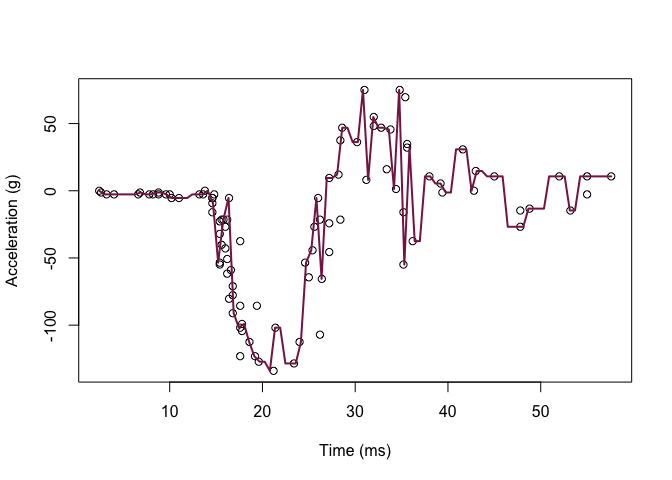
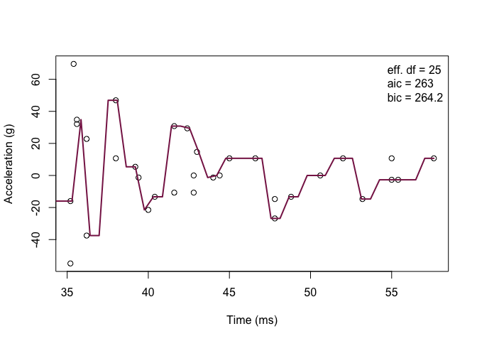
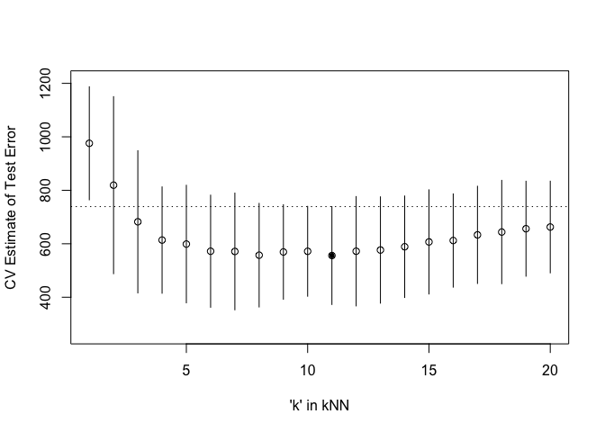

homework5
================

In the ISLR book, read section 6.1.3 “Choosing the Optimal Model” and
section 5.1 “Cross-Validation”. Extend and convert the attached
effective-df-aic-bic-mcycle.R R script into an R markdown file that
accomplishes the following tasks.

``` r
library('MASS') ## for 'mcycle'
library('manipulate') ## for 'manipulate'
library(tidyverse)
```

    ## ── Attaching packages ─────────────────────────────────────── tidyverse 1.3.1 ──

    ## ✓ ggplot2 3.3.5     ✓ purrr   0.3.4
    ## ✓ tibble  3.1.6     ✓ dplyr   1.0.8
    ## ✓ tidyr   1.2.0     ✓ stringr 1.4.0
    ## ✓ readr   2.1.2     ✓ forcats 0.5.1

    ## ── Conflicts ────────────────────────────────────────── tidyverse_conflicts() ──
    ## x dplyr::filter() masks stats::filter()
    ## x dplyr::lag()    masks stats::lag()
    ## x dplyr::select() masks MASS::select()

``` r
library(caret)
```

    ## Loading required package: lattice

    ## 
    ## Attaching package: 'caret'

    ## The following object is masked from 'package:purrr':
    ## 
    ##     lift

# Question 1: Randomly split the mcycle data into training (75%) and validation (25%) subsets.

``` r
#load data
mcycle <- mcycle
#split the mcycle data into training (75%) subsets
train<-sample_frac(mcycle, 0.75)
sid<-as.numeric(rownames(train))
# split the mcycle data into validation (25%) subsets
test<-mcycle[-sid,]
```

# Question 2: Using the mcycle data, consider predicting the mean acceleration as a function of time. Use the Nadaraya-Watson method with the k-NN kernel function to create a series of prediction models by varying the tuning parameter over a sequence of values. (hint: the script already implements this)

``` r
# predicting the mean acceleration
y <- train$accel
x <- matrix(train$times, length(train$times), 1)
```

## k-NN kernel function

``` r
## x  - n x p matrix of training inputs
## x0 - 1 x p input where to make prediction
## k  - number of nearest neighbors
kernel_k_nearest_neighbors <- function(x, x0, k=1) {
  ## compute distance betwen each x and x0
  z <- t(t(x) - x0)
  d <- sqrt(rowSums(z*z))

  ## initialize kernel weights to zero
  w <- rep(0, length(d))
  
  ## set weight to 1 for k nearest neighbors
  w[order(d)[1:k]] <- 1
  
  return(w)
}
```

## Make predictions using the NW method

``` r
## y  - n x 1 vector of training outputs
## x  - n x p matrix of training inputs
## x0 - m x p matrix where to make predictions
## kern  - kernel function to use
## ... - arguments to pass to kernel function
nadaraya_watson <- function(y, x, x0, kern, ...) {
  k <- t(apply(x0, 1, function(x0_) {
    k_ <- kern(x, x0_, ...)
    k_/sum(k_)
  }))
  yhat <- drop(k %*% y)
  attr(yhat, 'k') <- k
  return(yhat)
}
```

``` r
## create a grid of inputs 
x_plot <- matrix(seq(min(x),max(x),length.out=100),100,1)

## make predictions using NW method at training inputs
y_hat_plot <- nadaraya_watson(y, x, x_plot,
  kernel_k_nearest_neighbors)

## plot predictions
plot(x, y, xlab="Time (ms)", ylab="Acceleration (g)")
lines(x_plot, y_hat_plot, col="#882255", lwd=2) 
```

<!-- -->

``` r
## set k from 1 to 10
k_seq=seq(1, 10, by = 1)
## make predictions using NW method at training inputs
for (n in k_seq){
  y_hat_plot <- nadaraya_watson(y, x, x_plot, kernel_k_nearest_neighbors, n)
}
```

# Question 4: With the squared-error loss function, compute and plot the training error, AIC, BIC, and validation error (using the validation data) as functions of the tuning parameter.

``` r
#Use validation data
y <- test$accel
x <- matrix(test$times, length(test$times), 1)
```

## the squared-error loss function

``` r
## loss function
## y    - train/test y
## yhat - predictions at train/test x
loss_squared_error <- function(y, yhat)
  (y - yhat)^2
```

## test/train error

``` r
## y    - train/test y
## yhat - predictions at train/test x
## loss - loss function
error <- function(y, yhat, loss=loss_squared_error)
  mean(loss(y, yhat))
```

## AIC

``` r
## y    - training y
## yhat - predictions at training x
## d    - effective degrees of freedom
aic <- function(y, yhat, d)
  error(y, yhat) + 2/length(y)*d
```

## BIC

``` r
## y    - training y
## yhat - predictions at training x
## d    - effective degrees of freedom
bic <- function(y, yhat, d)
  error(y, yhat) + log(length(y))/length(y)*d
```

``` r
## Compute effective df using NW method
## y  - n x 1 vector of training outputs
## x  - n x p matrix of training inputs
## kern  - kernel function to use
## ... - arguments to pass to kernel function
effective_df <- function(y, x, kern, ...) {
  y_hat <- nadaraya_watson(y, x, x,
    kern=kern, ...)
  sum(diag(attr(y_hat, 'k')))
}
```

``` r
## how does k affect shape of predictor and eff. df using k-nn kernel ?

   ## make predictions using NW method at training inputs
   y_hat <- nadaraya_watson(y, x, x,
     kern=kernel_k_nearest_neighbors, k=1)
   edf <- effective_df(y, x, 
     kern=kernel_k_nearest_neighbors, k=1)
   aic_ <- aic(y, y_hat, edf)
   bic_ <- bic(y, y_hat, edf)
   y_hat_plot <- nadaraya_watson(y, x, x_plot,
     kern=kernel_k_nearest_neighbors, k=1)
   plot(x, y, xlab="Time (ms)", ylab="Acceleration (g)")
   legend('topright', legend = c(
     paste0('eff. df = ', round(edf,1)),
     paste0('aic = ', round(aic_, 1)),
     paste0('bic = ', round(bic_, 1))),
     bty='n')
   lines(x_plot, y_hat_plot, col="#882255", lwd=2) 
```

<!-- -->

# Question 4: For each value of the tuning parameter, Perform 5-fold cross-validation using the combined training and validation data. This results in 5 estimates of test error per tuning parameter value.

## 5-fold cross-validation of knnreg model

``` r
## create five folds
set.seed(100)
mcycle_flds  <- createFolds(mcycle$accel, k=5)
print(mcycle_flds)
```

    ## $Fold1
    ##  [1]   5  13  21  23  35  37  39  48  49  61  63  65  66  68  77  83  88  93 117
    ## [20] 119 123 126 127 128 133
    ## 
    ## $Fold2
    ##  [1]   4   8   9  10  11  15  19  30  31  38  41  44  47  53  56  73  80  84  87
    ## [20]  90  91 104 107 110 120 122 129
    ## 
    ## $Fold3
    ##  [1]   3  14  16  18  20  29  32  34  46  57  60  62  71  72  75  76  79  81  92
    ## [20]  94 102 103 108 114 116 118 121
    ## 
    ## $Fold4
    ##  [1]   2   6   7  17  22  27  33  42  43  45  51  52  55  67  70  78  82  85  89
    ## [20]  99 105 106 109 111 112 131 132
    ## 
    ## $Fold5
    ##  [1]   1  12  24  25  26  28  36  40  50  54  58  59  64  69  74  86  95  96  97
    ## [20]  98 100 101 113 115 124 125 130

``` r
sapply(mcycle_flds, length) 
```

    ## Fold1 Fold2 Fold3 Fold4 Fold5 
    ##    25    27    27    27    27

## 5 estimates of test error

``` r
cvknnreg <- function(kNN = 10, flds=mcycle_flds) {
  cverr <- rep(NA, length(flds))
  for(tst_idx in 1:length(flds)) { ## for each fold
    
    ## get training and testing data
    mcycle_trn <- mcycle[-flds[[tst_idx]],]
    mcycle_tst <- mcycle[ flds[[tst_idx]],]
    
    ## fit kNN model to training data
    knn_fit <- knnreg(accel ~ times,
                      k=kNN, data=mcycle_trn)
    
    ## compute test error on testing data
    pre_tst <- predict(knn_fit, mcycle_tst)
    cverr[tst_idx] <- mean((mcycle_tst$accel - pre_tst)^2)
  }
  return(cverr)
}
```

# Question 5: Plot the CV-estimated test error (average of the five estimates from each fold) as a function of the tuning parameter. Add vertical line segments to the figure (using the segments function in R) that represent one “standard error” of the CV-estimated test error (standard deviation of the five estimates from each fold).

# CV-estimated test error

``` r
## Compute 5-fold CV for kNN = 1:20
cverrs <- sapply(1:20, cvknnreg)
print(cverrs) ## rows are k-folds (1:5), cols are kNN (1:20)
```

    ##           [,1]      [,2]     [,3]     [,4]     [,5]     [,6]     [,7]     [,8]
    ## [1,]  997.6650  714.4913 587.1123 581.2436 545.2505 559.8968 546.8003 539.7921
    ## [2,]  695.4783  496.4465 396.9731 440.2303 398.1633 342.0288 272.9376 203.2395
    ## [3,]  968.1346  831.0187 846.0472 893.5528 835.8301 897.0734 850.0409 867.3185
    ## [4,] 1080.4844 1001.1064 859.7604 722.0259 730.2249 785.8331 799.7283 852.0883
    ## [5,]  989.0818  977.3568 586.6572 461.5940 555.2788 541.7706 580.8977 549.4356
    ##          [,9]    [,10]    [,11]    [,12]    [,13]    [,14]    [,15]    [,16]
    ## [1,] 569.9457 553.4544 566.2010 573.8413 524.9770 558.6340 589.6369 590.0329
    ## [2,] 213.9730 237.9303 245.9675 264.8992 259.4090 261.9348 280.7410 296.0850
    ## [3,] 800.2472 837.5268 763.6965 802.4372 811.7969 821.9348 803.4317 768.8459
    ## [4,] 898.8261 869.2792 861.9321 873.6781 860.3733 892.9122 907.2119 916.5713
    ## [5,] 530.8701 570.3775 594.1729 576.5968 606.6121 636.4485 641.0222 655.2628
    ##         [,17]    [,18]    [,19]    [,20]
    ## [1,] 634.0665 644.9846 606.3355 621.9942
    ## [2,] 291.3015 311.0821 289.8378 296.4595
    ## [3,] 810.2704 788.6716 794.2236 819.0443
    ## [4,] 879.4238 850.7059 896.7049 940.8030
    ## [5,] 701.6257 720.3958 775.2623 819.0434

``` r
cverrs_mean <- apply(cverrs, 2, mean)
cverrs_sd   <- apply(cverrs, 2, sd)
## Plot the results of 5-fold CV for kNN = 1:20
plot(x=1:20, y=cverrs_mean, 
     ylim=range(cverrs),
     xlab="'k' in kNN", ylab="CV Estimate of Test Error")
segments(x0=1:20, x1=1:20,
         y0=cverrs_mean-cverrs_sd,
         y1=cverrs_mean+cverrs_sd)
best_idx <- which.min(cverrs_mean)
points(x=best_idx, y=cverrs_mean[best_idx], pch=20)
abline(h=cverrs_mean[best_idx] + cverrs_sd[best_idx], lty=3) 
```

<!-- -->

# Question 6:Interpret the resulting figures and select a suitable value for the tuning parameter.

From the glot, we can see that k equals 8 is th best here. Then K \>8,
both test and train errors increase.
