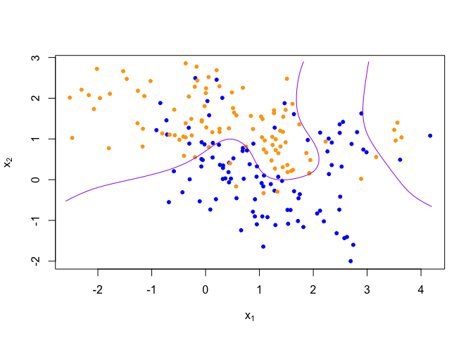
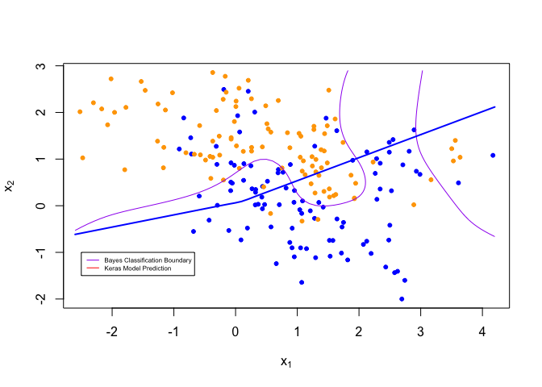
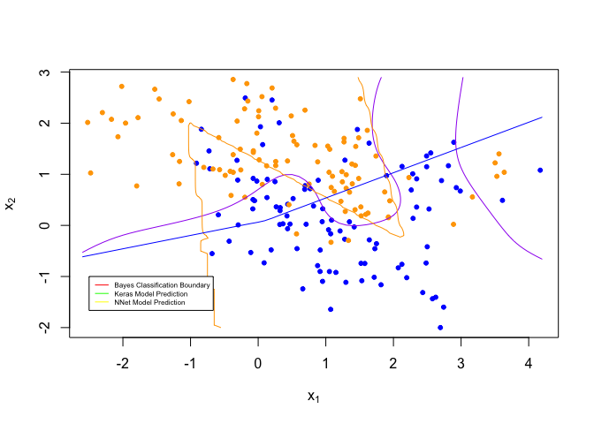

homework7
================

Goal: Get started using Keras to construct simple neural networks Work
through the “Image Classification” tutorial on the RStudio Keras
website. Create a figure to illustrate that the predictions are (or are
not) similar using the ‘nnet’ function versus the Keras model. (optional
extra credit) Convert the neural network described in the “Image
Classification” tutorial to a network that is similar to one of the
convolutional networks described during lecture on 4/15 (i.e., Net-3,
Net-4, or Net-5) and also described in the ESL book section 11.7. See
the !ConvNet tutorial on the RStudio Keras website.

\` # Work through the “Image Classification” tutorial on the RStudio
Keras website

``` r
library(keras)
library(tensorflow)
# Please use the follow to add model
#install_keras()
```

``` r
# load data
fashion_mnist <- dataset_fashion_mnist()
```

    ## Loaded Tensorflow version 2.8.0

``` r
c(train_images, train_labels) %<-% fashion_mnist$train
c(test_images, test_labels) %<-% fashion_mnist$test
```

``` r
class_names = c('T-shirt/top',
                'Trouser',
                'Pullover',
                'Dress',
                'Coat', 
                'Sandal',
                'Shirt',
                'Sneaker',
                'Bag',
                'Ankle boot')
```

``` r
#exploration
dim(train_images)
```

    ## [1] 60000    28    28

``` r
dim(train_labels)
```

    ## [1] 60000

``` r
train_labels[1:20]
```

    ##  [1] 9 0 0 3 0 2 7 2 5 5 0 9 5 5 7 9 1 0 6 4

``` r
dim(test_labels)
```

    ## [1] 10000

``` r
library(tidyr)
library(ggplot2)

image_1 <- as.data.frame(train_images[1, , ])
colnames(image_1) <- seq_len(ncol(image_1))
image_1$y <- seq_len(nrow(image_1))
image_1 <- gather(image_1, "x", "value", -y)
image_1$x <- as.integer(image_1$x)

ggplot(image_1, aes(x = x, y = y, fill = value)) +
  geom_tile() +
  scale_fill_gradient(low = "white", high = "black", na.value = NA) +
  scale_y_reverse() +
  theme_minimal() +
  theme(panel.grid = element_blank())   +
  theme(aspect.ratio = 1) +
  xlab("") +
  ylab("")
```

<!-- -->

``` r
train_images <- train_images / 255
test_images <- test_images / 255
```

``` r
par(mfcol=c(5,5))
par(mar=c(0, 0, 1.5, 0), xaxs='i', yaxs='i')
for (i in 1:25) { 
  img <- train_images[i, , ]
  img <- t(apply(img, 2, rev)) 
  image(1:28, 1:28, img, col = gray((0:255)/255), xaxt = 'n', yaxt = 'n',
        main = paste(class_names[train_labels[i] + 1]))
}
```

<!-- -->

``` r
#build model
model <- keras_model_sequential()
model %>%
  layer_flatten(input_shape = c(28, 28)) %>%
  layer_dense(units = 128, activation = 'relu') %>%
  layer_dense(units = 10, activation = 'softmax')
# compile model
model %>% compile(
  optimizer = 'adam', # how model is updated based on data and loss
  loss = 'sparse_categorical_crossentropy', 
  metrics = c('accuracy') 
)

# train model
model %>% fit(train_images, train_labels, epochs = 5, verbose = 2) # ~89% accuracy
```

``` r
# evaluate error
score <- model %>% evaluate(test_images, test_labels, verbose = 0)
cat('Test loss:', score['loss'], "\n")
```

    ## Test loss: 0.3581046

``` r
#test accuracy
cat('Test accuracy:', score['accuracy'], "\n") # less accurate than train data, overfit
```

    ## Test accuracy: 0.8689001

``` r
#make prediction
predictions <- model %>% predict(test_images)
predictions[1, ] 
```

    ##  [1] 2.627785e-06 1.963664e-08 4.509658e-07 3.069705e-08 6.721209e-07
    ##  [6] 1.245997e-04 8.427967e-07 1.614138e-02 8.614951e-06 9.837207e-01

``` r
which.max(predictions[1, ])
```

    ## [1] 10

``` r
class_pred=model %>% predict(test_images) %>%k_argmax()
class_pred[1:20]
```

    ## tf.Tensor([9 2 1 1 6 1 4 6 5 7 4 5 7 3 4 1 2 2 8 0], shape=(20,), dtype=int64)

``` r
test_labels[1]
```

    ## [1] 9

``` r
par(mfcol=c(5,5))
par(mar=c(0, 0, 1.5, 0), xaxs='i', yaxs='i')
for (i in 1:25) { 
  img <- test_images[i, , ]
  img <- t(apply(img, 2, rev)) 
  # subtract 1 as labels go from 0 to 9
  predicted_label <- which.max(predictions[i, ]) - 1
  true_label <- test_labels[i]
  if (predicted_label == true_label) {
    color <- '#008800' 
  } else {
    color <- '#bb0000'
  }
  image(1:28, 1:28, img, col = gray((0:255)/255), xaxt = 'n', yaxt = 'n',
        main = paste0(class_names[predicted_label + 1], " (",
                      class_names[true_label + 1], ")"),
        col.main = color)
}
```

<!-- -->

``` r
img <- test_images[1, , , drop = FALSE]
dim(img)
```

    ## [1]  1 28 28

``` r
predictions <- model %>% predict(img)
predictions
```

    ##              [,1]         [,2]         [,3]         [,4]         [,5]
    ## [1,] 2.627788e-06 1.963666e-08 4.509677e-07 3.069709e-08 6.721218e-07
    ##              [,6]         [,7]       [,8]         [,9]     [,10]
    ## [1,] 0.0001245999 8.427978e-07 0.01614139 8.614986e-06 0.9837207

``` r
# subtract 1 as labels are 0-based
prediction <- predictions[1, ] - 1
which.max(prediction)
```

    ## [1] 10

``` r
class_pred <- model %>% predict(img) %>%k_argmax()
class_pred
```

    ## tf.Tensor([9], shape=(1,), dtype=int64)

# Use the Keras library to re-implement the simple neural network discussed during lecture for the datture data (see nnet.R). Use a single 10-node hidden layer; fully connected.

``` r
library('rgl')
library('nnet')
library('dplyr')
```

    ## 
    ## Attaching package: 'dplyr'

    ## The following objects are masked from 'package:stats':
    ## 
    ##     filter, lag

    ## The following objects are masked from 'package:base':
    ## 
    ##     intersect, setdiff, setequal, union

``` r
library('ElemStatLearn')
```

``` r
## load binary classification example data
data("datture.example")
```

    ## Warning in data("datture.example"): data set 'datture.example' not found

``` r
dat <- mixture.example
```

``` r
set.seed(1)
#initializes model
k_model <- keras_model_sequential()
#creates 10-node hidden layer
k_model %>%
  #builds 10-node hidden layer
  layer_dense(units = 10, activation = 'relu') %>%
  #builds binary output layer
  layer_dense(units = 2, activation = 'softmax') 
#complies model
k_model %>% compile(
  optimizer = 'adam', 
  loss = 'sparse_categorical_crossentropy',
  metrics = c('accuracy')
)
```

``` r
set.seed(1)
#fits model
k_model %>% fit(x = dat$x, y = dat$y, epochs = 5, verbose = 2)
```

``` r
#checks accuracy and loss
k_score <- k_model %>% evaluate(dat$x, dat$y, verbose = 0)
cat('Test loss:', k_score[1], "\n")
```

    ## Test loss: 0.5497499

``` r
cat('Test accuracy:', k_score[2], "\n")
```

    ## Test accuracy: 0.705

``` r
#Uses Prof. Shotwell's code to print datture data with true contour line
plot_datture_data <- expression({
  plot(dat$x[,1], dat$x[,2],
       col=ifelse(dat$y==0, 'blue', 'orange'),
       pch=20,
       xlab=expression(x[1]),
       ylab=expression(x[2]))
  ## draw Bayes (True) classification boundary
  prob <- matrix(dat$prob, length(dat$px1), length(dat$px2))
  cont <- contourLines(dat$px1, dat$px2, prob, levels=0.5)
  rslt <- sapply(cont, lines, col='purple')
})
#tests to ensure it works
eval(plot_datture_data)
```

<!-- -->

``` r
set.seed(1)
#Predicts values based on constructed model
k_probs = k_model %>% predict(dat$xnew)
plot_k_preds <- function() {
  
  #plots original data
  eval(plot_datture_data)
  #computes and plots keras prediction
  probs <- k_probs[,1]
  probm <- matrix(probs, length(dat$px1), length(dat$px2))
  cls <- contourLines(dat$px1, dat$px2, probm, levels=0.5)
  rslt <- sapply(cls, lines, col='blue', lwd = 2)
  legend(-2.5,-1, legend=c("Bayes Classification Boundary", "Keras Model Prediction"), col=c("purple", "red"), lty=1:1, cex=0.5)
}
plot_k_preds()
```

<!-- -->

# Create a figure to illustrate that the predictions are (or are not) similar using the ‘nnet’ function versus the Keras model.

``` r
set.seed(1)
nn_fit <- nnet(x=dat$x, y=dat$y, size=5, entropy=TRUE, decay=0)
```

    ## # weights:  21
    ## initial  value 149.099012 
    ## iter  10 value 99.179808
    ## iter  20 value 92.961824
    ## iter  30 value 81.052048
    ## iter  40 value 80.356066
    ## iter  50 value 80.292623
    ## iter  60 value 80.023509
    ## iter  70 value 79.755785
    ## iter  80 value 79.635729
    ## iter  90 value 79.422412
    ## iter 100 value 79.337363
    ## final  value 79.337363 
    ## stopped after 100 iterations

``` r
nn_probs <- predict(nn_fit, dat$xnew, type="raw")[,1]
nn_preds <- function() {
    eval(plot_datture_data)
  
  probs <- nn_probs
  probm <- matrix(probs, length(dat$px1), length(dat$px2))
  cls <- contourLines(dat$px1, dat$px2, probm, levels=0.5)
  rslt <- sapply(cls, lines, col='orange', lwd = 1)
  
  probs1 <- k_probs
  probm1 <- matrix(probs1, length(dat$px1), length(dat$px2))
  cls1 <- contourLines(dat$px1, dat$px2, probm1, levels=0.5)
  rslt1 <- sapply(cls1, lines, col='blue', lwd = 1)
  
  legend(-2.5,-1, legend=c("Bayes Classification Boundary", 
                           "Keras Model Prediction", 
                           "NNet Model Prediction"), 
         col=c("red", "green","yellow"), lty=1:1, cex=0.5)
  
}
nn_preds()
```

<!-- --> # Thus,
we can find that the results are very close.
