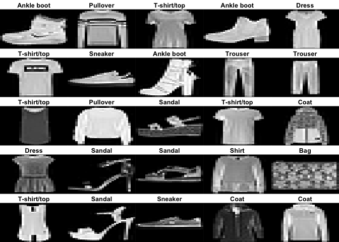
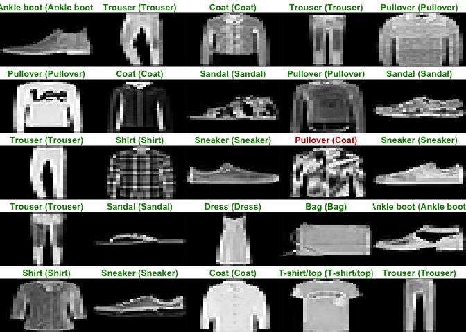

homework7
================

Goal: Get started using Keras to construct simple neural networks Work
through the “Image Classification” tutorial on the RStudio Keras
website. Use the Keras library to re-implement the simple neural network
discussed during lecture for the mixture data (see nnet.R). Use a single
10-node hidden layer; fully connected. Create a figure to illustrate
that the predictions are (or are not) similar using the ‘nnet’ function
versus the Keras model. (optional extra credit) Convert the neural
network described in the “Image Classification” tutorial to a network
that is similar to one of the convolutional networks described during
lecture on 4/15 (i.e., Net-3, Net-4, or Net-5) and also described in the
ESL book section 11.7. See the !ConvNet tutorial on the RStudio Keras
website.

\`

``` r
library(keras)
library(tensorflow)
```

``` r
# load data
fashion_mnist <- dataset_fashion_mnist()
```

    ## Loaded Tensorflow version 2.8.0

``` r
c(train_images, train_labels) %<-% fashion_mnist$train
c(test_images, test_labels) %<-% fashion_mnist$test
```

``` r
class_names = c('T-shirt/top',
                'Trouser',
                'Pullover',
                'Dress',
                'Coat', 
                'Sandal',
                'Shirt',
                'Sneaker',
                'Bag',
                'Ankle boot')
```

``` r
#exploration
dim(train_images)
```

    ## [1] 60000    28    28

``` r
dim(train_labels)
```

    ## [1] 60000

``` r
train_labels[1:20]
```

    ##  [1] 9 0 0 3 0 2 7 2 5 5 0 9 5 5 7 9 1 0 6 4

``` r
dim(test_labels)
```

    ## [1] 10000

``` r
library(tidyr)
library(ggplot2)

image_1 <- as.data.frame(train_images[1, , ])
colnames(image_1) <- seq_len(ncol(image_1))
image_1$y <- seq_len(nrow(image_1))
image_1 <- gather(image_1, "x", "value", -y)
image_1$x <- as.integer(image_1$x)

ggplot(image_1, aes(x = x, y = y, fill = value)) +
  geom_tile() +
  scale_fill_gradient(low = "white", high = "black", na.value = NA) +
  scale_y_reverse() +
  theme_minimal() +
  theme(panel.grid = element_blank())   +
  theme(aspect.ratio = 1) +
  xlab("") +
  ylab("")
```

<!-- -->

``` r
train_images <- train_images / 255
test_images <- test_images / 255
```

``` r
par(mfcol=c(5,5))
par(mar=c(0, 0, 1.5, 0), xaxs='i', yaxs='i')
for (i in 1:25) { 
  img <- train_images[i, , ]
  img <- t(apply(img, 2, rev)) 
  image(1:28, 1:28, img, col = gray((0:255)/255), xaxt = 'n', yaxt = 'n',
        main = paste(class_names[train_labels[i] + 1]))
}
```

<!-- -->

``` r
#build model
model <- keras_model_sequential()
model %>%
  layer_flatten(input_shape = c(28, 28)) %>%
  layer_dense(units = 128, activation = 'relu') %>%
  layer_dense(units = 10, activation = 'softmax')
# compile model
model %>% compile(
  optimizer = 'adam', # how model is updated based on data and loss
  loss = 'sparse_categorical_crossentropy', 
  metrics = c('accuracy') 
)

# train model
model %>% fit(train_images, train_labels, epochs = 5, verbose = 2) # ~89% accuracy
```

``` r
# evaluate error
score <- model %>% evaluate(test_images, test_labels, verbose = 0)
cat('Test loss:', score['loss'], "\n")
```

    ## Test loss: 0.3488303

``` r
#test accuracy
cat('Test accuracy:', score['accuracy'], "\n") # less accurate than train data, overfit
```

    ## Test accuracy: 0.8743001

``` r
#make prediction
predictions <- model %>% predict(test_images)
predictions[1, ] 
```

    ##  [1] 1.679491e-04 1.716317e-08 3.302233e-06 2.568445e-08 2.272952e-05
    ##  [6] 6.170888e-02 3.015726e-05 8.989216e-02 1.904775e-05 8.481557e-01

``` r
which.max(predictions[1, ])
```

    ## [1] 10

``` r
class_pred=model %>% predict(test_images) %>%k_argmax()
class_pred[1:20]
```

    ## tf.Tensor([9 2 1 1 6 1 4 6 5 7 4 5 5 3 4 1 2 2 8 0], shape=(20,), dtype=int64)

``` r
test_labels[1]
```

    ## [1] 9

``` r
par(mfcol=c(5,5))
par(mar=c(0, 0, 1.5, 0), xaxs='i', yaxs='i')
for (i in 1:25) { 
  img <- test_images[i, , ]
  img <- t(apply(img, 2, rev)) 
  # subtract 1 as labels go from 0 to 9
  predicted_label <- which.max(predictions[i, ]) - 1
  true_label <- test_labels[i]
  if (predicted_label == true_label) {
    color <- '#008800' 
  } else {
    color <- '#bb0000'
  }
  image(1:28, 1:28, img, col = gray((0:255)/255), xaxt = 'n', yaxt = 'n',
        main = paste0(class_names[predicted_label + 1], " (",
                      class_names[true_label + 1], ")"),
        col.main = color)
}
```

<!-- -->

``` r
img <- test_images[1, , , drop = FALSE]
dim(img)
```

    ## [1]  1 28 28

``` r
predictions <- model %>% predict(img)
predictions
```

    ##              [,1]         [,2]         [,3]         [,4]         [,5]
    ## [1,] 0.0001679487 1.716317e-08 3.302229e-06 2.568442e-08 2.272952e-05
    ##            [,6]         [,7]       [,8]         [,9]     [,10]
    ## [1,] 0.06170886 3.015722e-05 0.08989214 1.904771e-05 0.8481559

``` r
# subtract 1 as labels are 0-based
prediction <- predictions[1, ] - 1
which.max(prediction)
```

    ## [1] 10

``` r
class_pred <- model %>% predict(img) %>%k_argmax()
class_pred
```

    ## tf.Tensor([9], shape=(1,), dtype=int64)
